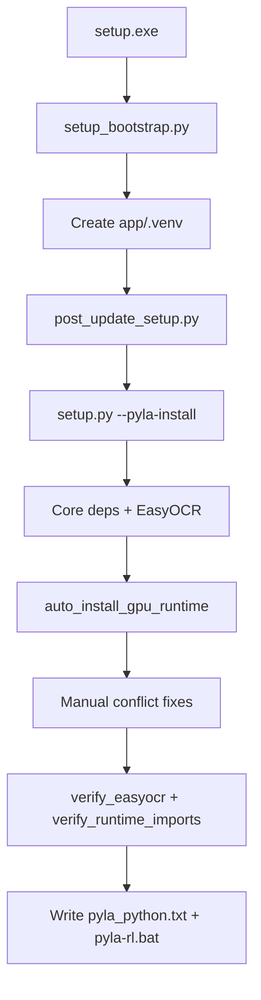

# Fix Pyla-RL Setup Dependency Failures

## Problem summary

Users report four related failures after running `setup.exe`:

| Symptom | Root cause in current code |
|---------|---------------------------|
| `Dependencies are not installed for this Python` ([pyla-rl.bat](pyla-rl.bat)) | Setup partially completes or pins the wrong interpreter; launcher import gate fails on `cv2/pandas/onnxruntime/easyocr/scipy/skimage/torch` |
| `easyocr requires opencv-python-headless` pip warning | EasyOCR declares headless OpenCV; setup installs it with `--no-deps` but never re-runs conflict repair after later installs (torch, ultralytics, GPU stack) |
| `scrcpy-client 0.4.7 requires adbutils<2.0` but `adbutils 2.12.0` installed | Old PyPI `scrcpy-client` is never uninstalled before installing the v0.5.0 zip with `--no-deps`; pip check warns even when runtime works |
| `cublasLt64_13.dll` missing (ONNX CUDA) | [cuda_runtime_paths.py](app/cuda_runtime_paths.py) only checks `cublasLt64_12.dll`; [gpu_runtime_install.py](app/gpu_runtime_install.py) only installs `nvidia-*-cu12` wheels, but latest `onnxruntime-gpu` from PyPI may require CUDA 13 DLLs |
| `setup.exe` cmd closes immediately | [frozen_exe_launcher.py](app/tools/frozen_exe_launcher.py) exits without pause when Python is missing; [setup_bootstrap.py](app/tools/setup_bootstrap.py) returns `1` from `run_full_project_setup` failure without `input()` |

Current install flow (unchanged conceptually):



The logic to fix conflicts **exists** but is fragmented, runs at the wrong times, and misses newer ONNX CUDA requirements.

---

## Implementation plan

### 1. Centralize conflict repair in one module

Add [app/tools/dependency_repair.py](app/tools/dependency_repair.py) as the single source of truth:

```python
# Responsibilities (called with explicit python executable):
repair_opencv_conflicts()   # uninstall headless; force opencv-python==4.8.0.76 --no-deps
repair_scrcpy_stack()       # uninstall scrcpy-client; pin adbutils==2.12.0, av==12.3.0; install v0.5.0 zip --no-deps
repair_all_conflicts()      # both above + repair_numpy()
verify_pip_health()         # run `pip check`, allowlist known benign warnings, fail on real breakage
```

Replace duplicated blocks in:
- [app/setup.py](app/setup.py) (lines 185–191)
- [app/tools/post_update_setup.py](app/tools/post_update_setup.py) (lines 96–97)
- [app/tools/fix_gpu_runtime.py](app/tools/fix_gpu_runtime.py) (lines 56–65)
- [app/gpu_runtime_install.py](app/gpu_runtime_install.py) `repair_numpy()` OpenCV section

**Call `repair_all_conflicts()` at these points:**
1. After pre-venv numpy/opencv pin in `post_update_setup`
2. After `force_install(base_reqs)` in `setup.py` (ultralytics can pull headless)
3. After `install_easyocr_stack()` in `setup.py`
4. After GPU runtime install in `setup.py`
5. As the final mandatory step before verification in `setup.py`
6. At end of `fix_gpu_runtime.install_base_requirements()`

This directly fixes the EasyOCR/OpenCV and scrcpy/adbutils warnings users paste from Discord.

---

### 2. Fix ONNX CUDA DLL mismatch (cu12 vs cu13)

Update [app/cuda_runtime_paths.py](app/cuda_runtime_paths.py):

- Detect required cuBLAS DLL dynamically: accept **either** `cublasLt64_12.dll` **or** `cublasLt64_13.dll` (plus `cudnn64_9.dll`)
- Add helper `required_cublas_dll_name()` that inspects installed `onnxruntime` version/build metadata when possible, defaulting to trying both
- Expand `find_cuda_dll_directories()` search paths if needed (already scans `nvidia/**/bin`)

Update [app/gpu_runtime_install.py](app/gpu_runtime_install.py):

- Replace hard-coded `NVIDIA_CUDA_DLL_PACKAGES` (cu12-only) with version-aware install:
  - If installed ORT needs cu13: `nvidia-cublas-cu13`, `nvidia-cudnn-cu13`, `nvidia-cuda-runtime-cu13`
  - Else: keep existing cu12 packages
- In `repair_cuda_torch()` and CUDA verify path: install matching wheels **before** ONNX smoke test
- Call `add_cuda_dll_directories()` before any `import onnxruntime` during setup verification ([setup.py](app/setup.py) line 206)

**Fallback behavior (unchanged intent):** if CUDA DLLs still missing after repair, `auto_install_gpu_runtime()` already falls back to DirectML then CPU — but now the fallback will trigger reliably instead of leaving a broken CUDA provider that errors at runtime.

Optional safety pin (if dynamic detection is fragile): cap `onnxruntime-gpu` to last known CUDA-12-stable release in `install_variant("cuda")` — only as fallback, prefer dynamic cu12/cu13 repair first.

---

### 3. Make setup fail loudly instead of “completing with warnings”

In [app/setup.py](app/setup.py) and [app/tools/post_update_setup.py](app/tools/post_update_setup.py):

- After final `repair_all_conflicts()`, run `verify_pip_health()`; on failure, print actionable repair commands and `sys.exit(1)`
- Keep existing `verify_easyocr_runtime()` and `verify_runtime_imports()` gates (already present in post_update_setup)
- Add ONNX CUDA probe during setup when CUDA variant chosen: attempt `ort.InferenceSession` smoke test (reuse logic from [gpu_runtime_install.py](app/gpu_runtime_install.py) `smoke_test_variant`) — don’t mark setup complete if CUDA was selected but DLL load fails

This prevents the launcher message “Dependencies are not installed” when setup claimed success.

---

### 4. Fix setup window closing immediately

Add shared helper in [app/tools/setup_bootstrap.py](app/tools/setup_bootstrap.py):

```python
def pause_before_exit(code: int) -> int:
    if code != 0 or os.environ.get("PYLAAI_SETUP_NO_PAUSE") != "1":
        input("Press Enter to close...")
    return code
```

Apply to **all** early-exit paths:
- [app/tools/frozen_exe_launcher.py](app/tools/frozen_exe_launcher.py) — wrap `launch_setup()` return value with pause when exit code != 0 (or always for setup)
- [app/tools/setup_bootstrap.py](app/tools/setup_bootstrap.py) `main()` — call pause when `run_full_project_setup()` returns `False` (currently returns 1 silently at line 357)
- Ensure `setup.cmd` path gets the same behavior (already delegates to bootstrap)

Also add a top-level `try/except` in `setup_bootstrap.main()` so unexpected exceptions print traceback + pause.

---

### 5. Tighten install ordering in `setup.py`

Current order installs EasyOCR (CPU torch) then GPU install replaces torch — correct, but fragile. Adjust to:

1. Core deps (without easyocr)
2. GPU runtime (may replace torch)
3. EasyOCR stack (always after GPU torch is settled)
4. `repair_all_conflicts()`
5. Verify all

This avoids torch being swapped **after** EasyOCR verification and reduces “setup passed, launch failed” cases.

---

### 6. Tests

Extend existing tests (no new test files unless needed):

- [app/tests/test_cuda_runtime_paths.py](app/tests/test_cuda_runtime_paths.py) — add cu13 DLL detection case
- [app/tests/test_setup_bootstrap.py](app/tests/test_setup_bootstrap.py) — assert centralized `repair_all_conflicts` is used; assert pause-on-failure paths exist
- New [app/tests/test_dependency_repair.py](app/tests/test_dependency_repair.py) — unit test repair command sequencing and pip-check allowlist

---

## Files to change (primary)

| File | Change |
|------|--------|
| `app/tools/dependency_repair.py` | **New** — centralized conflict repair + pip health |
| `app/setup.py` | Reorder EasyOCR after GPU; use dependency_repair; hard fail on verify |
| `app/tools/post_update_setup.py` | Use dependency_repair; fail on pip health |
| `app/gpu_runtime_install.py` | CUDA 12/13-aware DLL install |
| `app/cuda_runtime_paths.py` | Dynamic cuBLAS DLL detection |
| `app/tools/fix_gpu_runtime.py` | Use dependency_repair |
| `app/tools/setup_bootstrap.py` | Pause on all failure paths |
| `app/tools/frozen_exe_launcher.py` | Pause when setup subprocess fails |
| Tests listed above | Cover new behavior |

---

## Post-implementation note for releases

Code changes fix `setup.cmd` and `python app/setup.py --pyla-install` immediately. **`setup.exe` is a PyInstaller wrapper** ([app/tools/frozen_launcher_setup.py](app/tools/frozen_launcher_setup.py)) — rebuilding it is required for double-click users to get the pause-on-error fix in the frozen entrypoint. Document in commit/PR: rebuild `setup.exe` before publishing.

---

## Expected user outcome

After rerunning setup:

1. Window stays open with clear error text if anything fails
2. `pip check` warnings for easyocr/scrcpy/adbutils are resolved or explicitly allowlisted
3. CUDA users get matching `nvidia-cublas-cu12` **or** `cu13` wheels; missing DLL errors stop or auto-fallback to DirectML/CPU
4. `pyla-rl.bat` passes the import gate when setup reports success

Manual recovery (unchanged, still printed on failure):

```
app\.venv\Scripts\python.exe app\tools\check_runtime.py
app\.venv\Scripts\python.exe app\tools\fix_gpu_runtime.py auto
```
