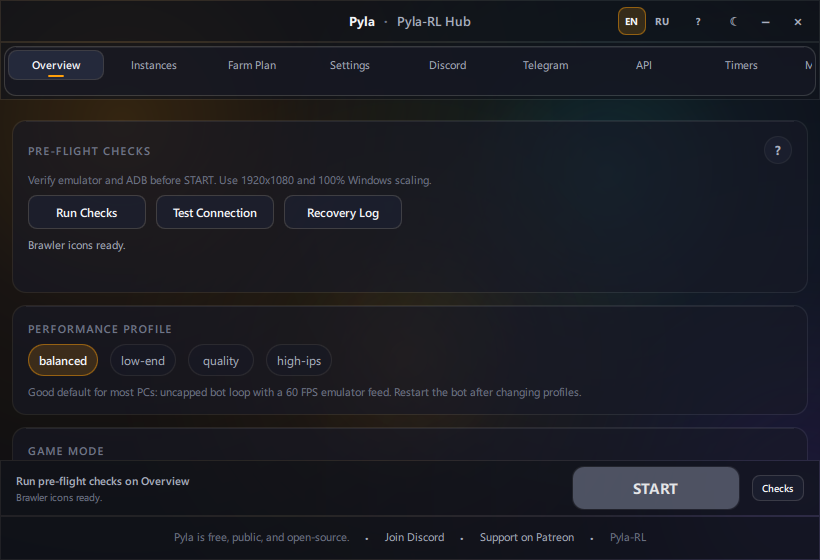
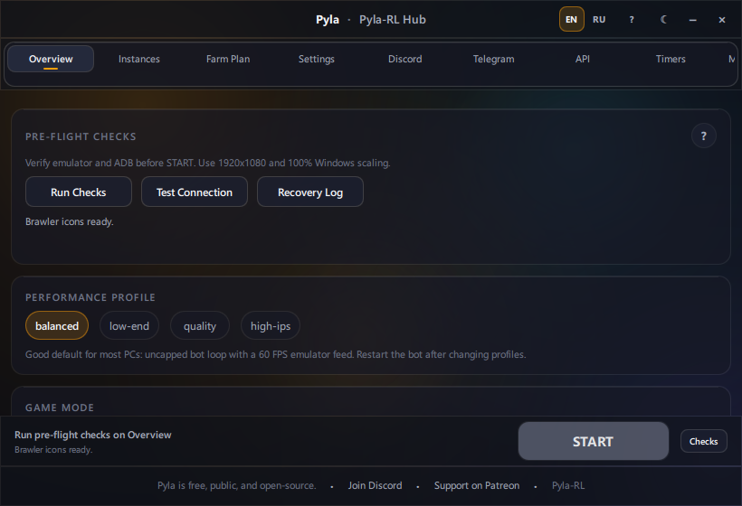
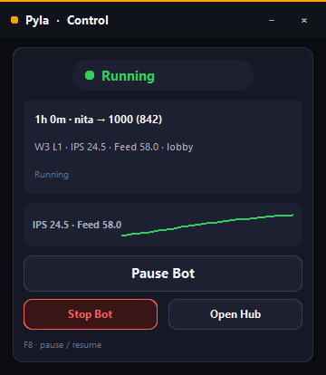
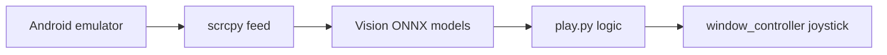

# Pyla-RL

[](app/docs/LICENSE)
[](https://www.python.org/downloads/)
[](https://github.com/CodeBanana69/Pyla-RL)
[-FF9F0A)](README.md#features)
[](https://discord.gg/xUusk3fw4A)
[](https://github.com/CodeBanana69/Pyla-RL)

**Showdown-focused Brawl Stars bot for Windows** — LDPlayer and MuMu, **aimbot** (smart lead aim), **dodgebot** (combat strafe dodge), analog joystick movement, farm-plan queue, and remote control from Discord or Telegram.

Pyla-RL is **free and open source**. Do not pay for copies, repacks, or "premium builds."

| | |
|---|---|
| **Source** | https://github.com/CodeBanana69/Pyla-RL |
| **Community** | [Pyla Discord](https://discord.gg/xUusk3fw4A) |
| **Tutorials** | [docs/TUTORIAL.md](app/docs/TUTORIAL.md) |
| **Quick start** | [Get started](#quick-start) below |

> **Note:** This is a source-code fork with a one-click Windows setup helper. Official builds and support are also available through the Pyla Discord. See [docs/ANTI_RESELLING.md](app/docs/ANTI_RESELLING.md).

## Screenshots

| Hub — Overview | Hub — Farm Plan | Pyla-RL Control |
|:---:|:---:|:---:|
|  |  |  |
| Pre-flight checks, **update pill**, performance profiles | Queue builder, Push All presets, import/export | Polished pause window — status pill, IPS graph, session strip |

Enable **Debug Screen** in Hub settings for a live vision overlay (player, walls, fog, ranges) while the bot runs.

## How it works



## Features

### Showdown gameplay

| | |
|---|---|
| Aimbot | Smart lead aim tracks moving enemies and aims the attack joystick ahead of them |
| Dodgebot | Combat dodge strafes sideways while shooting hittable enemies; respects walls and line of sight |
| Analog joystick | Continuous angle movement — smoother than WASD tap modes |
| Teammate follow | Follows trio mates when no enemy is visible; hysteresis avoids ping-pong |
| Team spacing | Orbits when grouped; biases back toward the team |
| Fog escape | Detects poison fog and overrides movement to flee |
| Wall unstuck | Semicircle escape when pressed against walls |
| Trophy tracking | 1st / 2nd / 3rd / 4th place end screens update trophies correctly |

### Hub and automation

| | |
|---|---|
| Farm plan queue | Build, sort, import/export brawler push targets |
| Push All 1k | Auto-queue every brawler under 1000 trophies |
| Brawl Stars API | Trophy autofill when picking brawlers ([setup guide](app/docs/tutorials/brawl-stars-api.md)) |
| Multi-instance | Parallel LDPlayer / MuMu bots ([guide](app/docs/tutorials/multi-instance.md)) |
| Performance profiles | Balanced, low-end, quality, high-ips presets |
| Update pill | Header pill checks `main`-branch freshness; popover shows commits and launches `updater.exe` |
| EN/RU UI | Language toggle in the Hub header; pause window strings follow the same catalog |

### Remote control

| | |
|---|---|
| Discord | `/pause`, `/start`, `/status`, `/screenshot`, `/queue`, `/push`, and more ([guide](app/docs/tutorials/discord-remote-control.md)) |
| Telegram | `/pause`, `/resume`, `/status`, `/screenshot`, farm-plan commands ([guide](app/docs/tutorials/telegram.md)) |
| Pause visibility | F8 pause; polished **Pyla-RL Control** window with status pill, IPS graph, and session strip |

### Reliability

| | |
|---|---|
| Crash recovery | Relaunch Brawl Stars if another app is in foreground |
| Feed recovery | Restart scrcpy on frozen video instead of looping app restarts |
| Idle dialog | Presses Reload on disconnect prompts |
| IPS status line | Live `IPS | feed FPS` in the terminal |

## Quick start

1. Run **`setup.exe`** in the project folder (installs Python 3.11 and dependencies).
2. Start **LDPlayer** or **MuMu**, open Brawl Stars, set **1920×1080**.
3. Launch **`pyla-rl.bat`** → Hub **Overview** → pick emulator → **Run Checks**.
4. Build a farm plan on **Farm Plan** (or use the legacy picker) → **START**.
5. Full walkthrough: [docs/tutorials/getting-started.md](app/docs/tutorials/getting-started.md)

<details>
<summary><strong>Emulator troubleshooting</strong></summary>

- Use **`pyla-rl.bat`** only (older launchers are removed by setup).
- **LDPlayer:** enable ADB in Settings → Other settings → ADB debugging, then restart. Default port `5555` (instance 1: `5557`, instance 2: `5559`).
- **MuMu:** confirm ADB is enabled. Default port `16384` (instance 1: `16416`).
- START requires the **ADB device** check. Emulator process, Brawl Stars foreground, and resolution are warnings only.

More: [docs/tutorials/troubleshooting.md](app/docs/tutorials/troubleshooting.md)

</details>

<details>
<summary><strong>Manual developer setup</strong></summary>

- Install Python 3.11 and Git.
- Run `python app/setup.py --pyla-install`.
- Run `python app/main.py` from the install folder (or use `pyla-rl.bat`).

</details>

## Documentation

| Topic | Guide |
|-------|--------|
| All tutorials | [docs/TUTORIAL.md](app/docs/TUTORIAL.md) |
| Repo layout | [docs/REPO_LAYOUT.md](app/docs/REPO_LAYOUT.md) |
| Discord webhooks | [docs/tutorials/discord.md](app/docs/tutorials/discord.md) |
| Discord remote control | [docs/tutorials/discord-remote-control.md](app/docs/tutorials/discord-remote-control.md) |
| Telegram | [docs/tutorials/telegram.md](app/docs/tutorials/telegram.md) |
| Brawl Stars API | [docs/tutorials/brawl-stars-api.md](app/docs/tutorials/brawl-stars-api.md) |
| Multi-instance | [docs/tutorials/multi-instance.md](app/docs/tutorials/multi-instance.md) |
| Settings and performance | [docs/tutorials/settings-and-performance.md](app/docs/tutorials/settings-and-performance.md) |
| Anti-reselling | [docs/ANTI_RESELLING.md](app/docs/ANTI_RESELLING.md) |

## Integrations (summary)

**Discord** — Set `webhook_url` for match notifications. For slash commands, add a bot token and enable `discord_control_enabled` in `cfg/discord_config.toml`. Full setup: [discord-remote-control.md](app/docs/tutorials/discord-remote-control.md).

**Telegram** — Create a bot with `@BotFather`, set `bot_token` and `enabled = true` in `cfg/telegram_config.toml`. Full setup: [telegram.md](app/docs/tutorials/telegram.md).

**Brawl Stars API** — Fill `cfg/brawl_stars_api.toml` for trophy autofill and Push All 1k. Full setup: [brawl-stars-api.md](app/docs/tutorials/brawl-stars-api.md). Do not commit filled tokens or passwords.

**Multi-instance** — Enable on the Hub **Instances** tab; each profile gets its own port and farm plan. Full setup: [multi-instance.md](app/docs/tutorials/multi-instance.md).

## Performance and vision

- Run `python app/tools/performance_check.py` if IPS is low.
- Apply a safe profile: `python app/tools/apply_performance_profile.py --profile balanced` (use `--profile low-end` on older laptops).
- Wall model training pipeline: capture → dataset → train → install via `app/tools/capture_wall_samples.py`, `app/tools/train_wall_model.py`, `app/tools/install_vision_model.py`. Details: [settings-and-performance.md](app/docs/tutorials/settings-and-performance.md).

Re-capture README screenshots after major UI changes: `python app/tools/capture_readme_assets.py`

## Tests

```bash
python -m unittest discover -s app/tests -t app
```

Single module from repo root:

```bash
python -m unittest app.tests.test_support_reporter -q
```

CI runs a core subset on every push to `main`.

## Notes

- Localhost fork: online login, auto icon/wall updates, and hosted stats are not enabled by default.
- Vision `.pt` models: https://github.com/AngelFireLA/BrawlStarsBotMaking
- Early-access features are not included before public release.
- **License:** CC BY-NC — do not sell or resell. See [docs/ANTI_RESELLING.md](app/docs/ANTI_RESELLING.md).

## Contributors

- Iyordanov
- AngelFire

## Contribute

Issues and pull requests are welcome. [Pyla Discord](https://discord.gg/xUusk3fw4A) · [Public Trello](https://trello.com/b/SAz9J6AA/public-pyla-trello)
