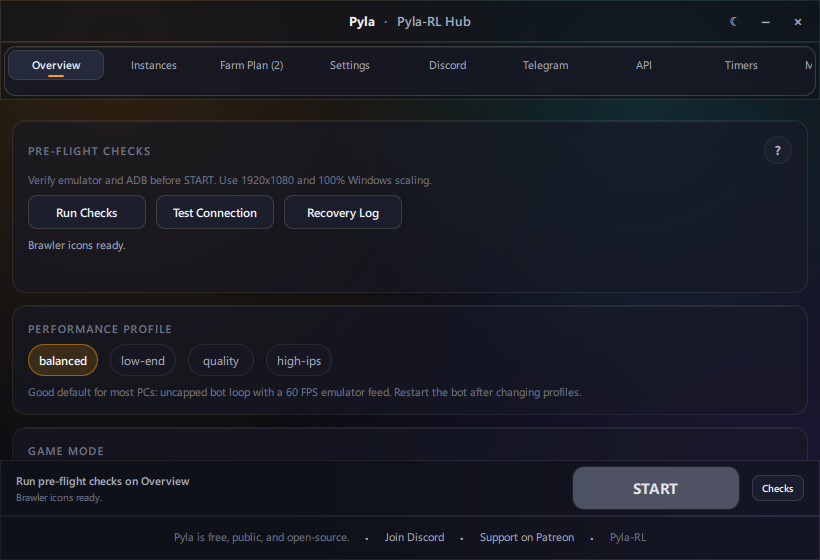

# Getting Started

## Install

1. Download or clone Pyla-RL from [GitHub](https://github.com/CodeBanana69/Pyla-RL) (see badges and links on the [main README](../../README.md)).
2. Run `setup.exe` in the project folder.
3. Wait for Python 3.11 and dependencies to install.

## Launch

1. Start your Android emulator (LDPlayer or MuMu).
2. Open Brawl Stars in the emulator.
3. Set emulator resolution to **1920x1080** (recommended).
4. Double-click **`pyla-rl.bat`** or run `python main.py`.

## First run

1. Accept the free-use license in the setup wizard.
2. On **Overview**, pick your emulator and click **Run Checks**.
3. Build a farm plan on **Farm Plan** (or leave empty for the legacy picker).
4. Press **START**.

See [Overview and START](overview-and-start.md) for pre-flight details.
