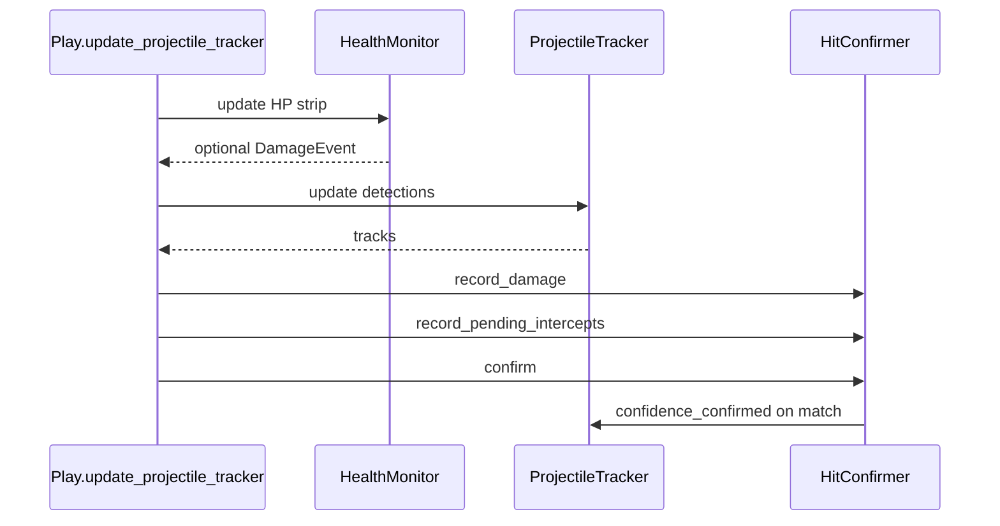

# Reinforcement learning movement (this fork's headline feature)

**Pyla-RL** is a reinforcement-learning fork of PylaAi-XXZ. It keeps
every brawler-specific attack, super, and gadget rule exactly as it was.
The only thing the RL policy controls is **movement** (approach /
retreat / strafe / dodge). Combat is run by `Play.run_combat()` after
the movement choice is made, so attack timing and aiming are unchanged
regardless of which mode is active.

Why this fork exists:

- Heuristic movement is brittle and brawler-specific. **SAC** learns
  positioning from **recorded** gameplay and dense shaped rewards.
- Projectile dodging is the single biggest source of damage —
  the tracker + reward shaping in this folder is built for that signal.
- Live play is **inference-only** (`SAC.predict`), so there is no mismatch
  between actions written to the rollout buffer and actions the game ran.

## Two-stage pipeline

1. **Live bot** (`use_rl_movement = "yes"`): builds a rich 27‑float/frame
   observation (`ObservationBuilder`), runs **`stable_baselines3.SAC`** in
   **deterministic** mode, executes the joystick / WASD action.
2. **Recording** (`enable_rl_movement_training` / `rl_record_transitions`): appends **executed**
   tuples `(obs, action, reward, next_obs, done)` to [`ReplayRecorder`](replay_recorder.py)
   (`data/rl_replay/*.npz`, atomic `os.replace` after shard write).
3. **Offline trainer** [`tools/train_rl_offline.py`](../tools/train_rl_offline.py): merges shards into a SB3 `ReplayBuffer`,
   sets `learning_starts=0`, runs `learn(total_timesteps=…)`. TensorBoard
   `--tensorboard` (default Hub launch: `<repo>/runs/rl_sac`).

## Settings (`cfg/bot_config.toml`)

| Key | Default | Effect |
| --- | --- | --- |
| `use_rl_movement` | `"no"` | Master switch — SAC chooses movement angles / WASD. |
| `enable_rl_movement_training` | `"no"` | **Repurposed gate:** `"yes"` records transitions while playing (offline gradient steps disabled). Same flag bound to Hub **Record RL transitions (offline training)** (also mirrors `rl_record_transitions`). |
| `rl_record_transitions` | *(falls back to `enable_rl_movement_training` if omitted)* | Explicit `"yes"`/`"no"` in TOML when you want recording without renaming the checkbox key. Hub keeps both keys in sync. |
| `rl_algorithm` | `"sac"` | Only SAC is wired; unsupported values raise in `compute_rl_movement`. |
| `rl_movement_model_path` | `models/rl_movement_policy.zip` | Loaded SAC checkpoint. Recreated automatically if absent. |
| `rl_replay_dir` | `data/rl_replay` | Compressed `.npz` batches + `*_meta.json` sidecars. |
| `rl_replay_disk_budget_mb` | `2048` | Prune oldest `.npz` when total size overflows. |
| `rl_replay_batch_size` | `1000` | Shard when buffered transitions exceed this count. |
| `rl_replay_flush_seconds` | `30` | Periodic flush cadence (whichever triggers first vs batch cap). |
| `rl_frame_stack` | `1` | Stacks last **K** frames → observation length **27·K**. |
| `rl_obs_use_hp`, `rl_obs_use_fog`, `rl_obs_use_walls`, `rl_obs_use_super` | `"yes"` | Feature toggles; fog-off writes **`1.0`** ray distances so shaping penalties tied to fog min-distance stay inactive. |
| `rl_fog_ray_max_px` / `rl_fog_ray_step_px` | `200` / `4` | Fog raycasts via [`Play._build_trusted_fog_mask`](../play.py). |
| `rl_hp_potential_coef` | `1.0` | Potential-based shaping on observed HP fraction. |
| `rl_stationary_penalty`, `rl_stationary_need_seconds`, `rl_stationary_small_action_mag` | `0.05` / `2.0` / `0.1` | Applied when microscopic actions persist (see [`stationary_seconds`](observation_builder.py)). |
| `rl_wall_hug_penalty`, `rl_wall_hug_min_walls` | `0.05` / `3` | Penalize clustered walls around player quadrants (`wall_quadrant_counts`). |
| `rl_fog_proximity_penalty`, `rl_fog_proximity_threshold` | `0.10` / `0.15` | Penalty × `Δt` when the nearest fog ray is below the threshold. |
| `rl_sac_gamma` | `0.97` | Discount used by SAC + mirrored in offline `--gamma`. Lower than `0.99` improves credit to terminal placement rewards across long showdowns. |
| `rl_train_steps_per_update` / `rl_save_every_seconds` | *(legacy leftovers)* | **Unused** by the SAC bridge; kept only for backwards-compatible config files / hub expectations. |

`rl_use_projectile_features` continues to steer **whether projectile tracks are fused into movement heuristics & debug overlays**; the SAC observation is the fixed **ObservationBuilder** vector (projectile tensor layout is unrelated).

### Projectile tracking backend (`cfg/bot_config.toml`)

| Key | Default | Effect |
| --- | ------- | ------ |
| `projectile_tracker_backend` | `"bytetrack"` | `"bytetrack"` uses [`supervision`](https://github.com/roboflow/supervision) `ByteTrack` (`rl/byte_projectile_tracker.py`). `"greedy"` uses the legacy greedy matcher in [`rl/projectile_tracker.py`](../rl/projectile_tracker.py). If `supervision` is missing, the bot logs once and falls back to greedy. |
| `projectile_bytetrack_high_thresh` | `0.5` | ByteTrack `track_activation_threshold` — detections above this take the high-score association path. |
| `projectile_bytetrack_low_thresh` | `0.1` | Reserved (library lower bound for low-score path is fixed in `supervision`); kept for future tuning. |
| `projectile_bytetrack_match_thresh` | `0.8` | ByteTrack `minimum_matching_threshold` for IoU matching. |
| `projectile_bytetrack_lost_seconds` | `0.5` | Converted to `lost_track_buffer` frames via `projectile_bytetrack_frame_rate`. |
| `projectile_bytetrack_frame_rate` | `30` | Nominal FPS passed to ByteTrack (lost-buffer scaling). |

Synthetic per-detector confidences are assigned before ByteTrack: `labeled=0.85`, `residual=0.55`, `motion=0.40` so YOLO boxes stay in the high path and motion blobs can use the low path.

### Intercept confirmation (`cfg/bot_config.toml`)

When **`cross_reference_projectile_hits = "yes"`** and **`intercept_confirm_enabled = "yes"`**, RL damage uses [`HitConfirmer`](../rl/hit_confirmer.py): each frame the tracker exposes `pending_intercepts` (incoming tracks with an ETA to overlap the player box). Expected wall-clock hit time is `now + eta`. A [`DamageEvent`](../rl/health_monitor.py) within **`intercept_confirm_tolerance_seconds`** of that time confirms the paired track (`confidence_confirmed`) and feeds `projectile_hit` via recent confirmations — **not** the older `is_player_hit AND recent_damage_event` boolean.

| Key | Default | Effect |
| --- | ------- | ------ |
| `intercept_confirm_enabled` | `"yes"` | Master switch (also hub checkbox). Requires `cross_reference_projectile_hits = "yes"` to take effect. |
| `intercept_confirm_tolerance_seconds` | `0.30` | Max \|predicted hit time − damage time\| for a match. |
| `intercept_confirm_max_lookahead_seconds` | `1.00` | Horizon for `ProjectileTrack.time_to_player_box` when building intercepts. |
| `intercept_confirm_min_streak` | `2` | Minimum `match_streak` for an intercept to count (same idea as promotion). |



### Health bar, damage events, red flash, cross-reference (`cfg/bot_config.toml`)

These tighten projectile **perception** and the RL **hit signal** when motion/residual layers hallucinate hits during damage flashes or UI tint.

**OCR-first HP detection.** [`rl/health_monitor.py`](../rl/health_monitor.py) now uses **EasyOCR as the source of truth** for player HP. At match start, the first stable read latches `max_hp`; every subsequent accepted read produces `hp_value` and `hp_value_pct`, drives a numeric `DamageEvent`, and prints a per-tick log line like:

```
[HP] match start full_hp=47900
[HP] full=47900 cur=39700 dmg=8200 (82.9%)
```

HSV is still computed cheaply and is used as a fallback **only until OCR latches**. To keep IPS healthy the OCR call runs on a single background worker thread unless CUDA-backed GPU is in use (`utils.DefaultEasyOCR`: **NVIDIA CUDA `gpu=true` by policy** via `easyocr_torch_gpu=auto` in `cfg/general_config.toml`; ROCm/AMD HIP is skipped by default because MiOpen/EasyOCR often crashes there, with automatic CPU downgrade if a MiOpen/`HIPRTC` runtime error slips through). Digit crop stays tiny + grayscale + CLAHE + `allowlist="0123456789"`. Poll cadence: **HP OCR poll rate (Hz)** in Hub **Additional** (default 5 Hz, range 1–15).

| Key | Default | Effect |
| --- | ------- | ------ |
| `health_bar_band_offset_px` | `8` | Vertical offset from player box top to HP strip (scaled by window scale factor). |
| `health_bar_band_height_px` | `14` | Height of HSV strip used for fill ratio. |
| `health_bar_search_height_px` | `40` | Vertical search window above the player to auto-align the HP strip when the fixed offset is slightly off. |
| `health_bar_horizontal_pad_px` | `26` | Minimum extra half-width (× scale) added to the crop so the HP bar fits when it is wider than the brawler box. |
| `health_bar_width_expand_frac` | `0.22` | Extra horizontal padding as a fraction of the player half-width (combined with the pad above). |
| `health_hsv_min_saturation` / `health_hsv_min_value` | `52` / `52` | Primary OpenCV HSV lower bounds for classifying UI green/red/yellow; lower values tolerate dim or bloomy HUD. |
| `health_hsv_relaxed_min_saturation` / `health_hsv_relaxed_min_value` | `38` / `38` | Fallback thresholds when the primary pass counts too few pixels (same game frame, avoids false `insufficient_pixels`). |
| `health_bar_yellow_enabled` | `"yes"` | Count yellow/orange HSV as “alive” HP fill (low HP). |
| `health_bar_shield_enabled` | `"yes"` | Count cyan HSV as “alive” (shield overlay). |
| `health_bar_min_total_pixels` | `40` | Target minimum colored pixels; the reader also scales this down for very small search crops (near the top of the screen). |
| `health_bar_min_consecutive_drops` | `2` | Consecutive frames below the prior-window max (by threshold) before emitting an HSV-pre-latch `DamageEvent`. |
| `health_ocr_primary` | `"yes"` | If `"yes"`, OCR is the source of truth and HSV is fallback-only. Set `"no"` to revert to the legacy HSV-primary pipeline. |
| `health_ocr_poll_hz` | `5.0` | Per-second OCR cadence. Slider in the Hub Additional tab (1–15 Hz, 0.5 step). Higher = more CPU, lower = laggier damage signal. |
| `health_ocr_run_in_thread` | `"auto"` | `"auto"` (background thread when no CUDA), `"yes"`, or `"no"` (inline; preferred on GPU). |
| `health_ocr_full_hp_lock_repeats` | `2` | Consecutive identical reads before `max_hp` latches at match start. |
| `health_ocr_min_confidence` | `0.25` | Reject OCR reads with EasyOCR confidence below this. Small HP digits on CPU EasyOCR often score 0.3–0.5, so the floor stays conservative. |
| `health_ocr_log_terminal` | `"yes"` | Print `[HP] full=… cur=… dmg=… (xx.x%)` when HP changes; with Power Cube OCR also appends `cubes=N base≈… (+… from cubes)` (Showdown). |
| `health_ocr_damage_drop_min` | `1` | Minimum absolute HP drop (in HP, not %) before an OCR-driven `DamageEvent` fires. |
| `health_hsv_fallback_enabled` | `"yes"` | When OCR has nothing to say (typically the first few frames), fall back to the HSV fill ratio for `last_hp_pct` and event detection. |
| `health_ocr_power_cubes` | `"auto"` | `"yes"` / `"no"` / `"auto"`. **auto**: OCR cube count only after `max_hp` is latched and `observed_max_hp >= health_power_cube_gate_max_hp` (default 3500). |
| `health_power_cube_hp_each` | `400` | Brawl Stars rule: each Power Cube adds this much to **maximum** HP; used for `base≈ max_hp - cubes × 400` in logs. |
| `health_ocr_cube_poll_hz` | `1.0` | How often to OCR the strip **above** the numeric HP (cube icon row). |
| `health_power_cube_gate_max_hp` | `3500` | In **auto** mode, skip cube OCR below this latched max HP (avoids junk reads in 3v3). |
| `health_ocr_enabled` | `"yes"` | Master OCR switch. When `"no"`, behaves like the legacy HSV-only path. |
| `health_ocr_interval_seconds` | `0.5` | Legacy minimum interval; only honored when `health_ocr_poll_hz <= 0`. |
| `health_ocr_validate_against_hsv` | `"yes"` | Legacy HSV cross-check (kept for old configs; the OCR-first path ignores HSV after latch). |
| `health_ocr_max_relative_jump` | `0.4` | Reject OCR readings that jump more than this fraction vs the previous accepted value. |
| `damage_hp_drop_threshold_pct` | `0.015` | Emit a damage event when valid HP% drops more than this vs rolling max in the prior ~0.4 s window. |
| `damage_confirm_window_seconds` | `0.5` | Lookback for “recent damage” when confirming tracks and when gating RL hits. |
| `red_flash_detect_enabled` | `"yes"` | Enable full-frame red-dominance spike detector (`rl/red_flash.py`). |
| `red_flash_red_dom_threshold` | `1.40` | Flash when `mean(R) / (0.5*(mean(G)+mean(B)))` exceeds baseline × this factor. |
| `red_flash_baseline_alpha` | `0.1` | EMA smoothing for the baseline when not flashing. |
| `cross_reference_projectile_hits` | `"yes"` | If `"yes"`, RL hit signal is strict (see intercept table). With **`intercept_confirm_enabled = "yes"`**, uses [`HitConfirmer`](../rl/hit_confirmer.py). Otherwise: requires **`ProjectileTracker.is_player_hit`** **and** a recent `HealthMonitor` damage event within `damage_confirm_window_seconds`. |

Implementation files: [`rl/health_monitor.py`](../rl/health_monitor.py), [`rl/red_flash.py`](../rl/red_flash.py), [`rl/hit_confirmer.py`](../rl/hit_confirmer.py), [`rl/byte_projectile_tracker.py`](../rl/byte_projectile_tracker.py); wiring in [`play.py`](../play.py) (`update_projectile_tracker`, visual debug); hit + reward glue in [`rl/policy_bridge.py`](policy_bridge.py).

The same toggles are exposed as checkboxes in `gui/hub.py` (the **Additional** tab) next to **Use RL Movement**, **Record RL transitions**, **Train RL offline**, **RL Projectile Observations**, **RL Projectile Debug Overlay**, and **RL HP Drop Penalty**.

## Observation layout (27 floats / frame)

Canonical indices live in [`observation_builder.py`](observation_builder.py) (`OB_*` constants):

| Block | Description |
| --- | --- |
| 0–1 | Player normalized center. |
| 2–3 | Velocity estimate (finite difference, diagonal-normalized). |
| 4–5 | HP fraction + normalized time since last `DamageEvent` look-back. |
| 6–7 | Super-ready + gadget-ready. |
| 8–16 | Two nearest enemies (`dx`,`dy`,`dist_norm`) + nearest teammate. |
| 17–20 | Fog clearance along cardinal rays (`1` ⇒ no fog within configured radius). |
| 21–24 | Quadrant occupancy of wall tiles (counts normalized). |
| 25–26 | Last SAC action clamped to `[-1,1]` (helps smooth locomotion).

Multiply by `frame_stack` for stacked observations consumed by SAC + ReplayRecorder shards.

## Live architecture snippet

```
vision ─► data dict ─► Play.loop
                       └► ObservationBuilder.build
                       └► SAC.predict (deterministic)
                       └► compute_reward_v2 (logging + replay label)
                       └► ReplayRecorder.append (optional)
                       └► run_combat ─► do_movement
```

[`MovementEnv`](movement_env.py) remains useful for isolated SB3 sandboxing / unit smoke tests, **not** mounted by the SAC bridge anymore.

### Offline CLI quick reference

```bash
python tools/train_rl_offline.py ^
  --replay-dir data/rl_replay ^
  --model-path models/rl_movement_policy.zip ^
  --total-steps 200000 ^
  --batch-size 512 ^
  --gamma 0.97 ^
  --tensorboard runs/rl_sac ^
  --device auto
```

### TensorBoard cheatsheet

Inspect `runs/rl_sac/` (or whichever `--tensorboard` path you chose) for:

- **Actor / critic losses** (`train/actor_loss_*`, critic losses reported by SAC).
- **Entropy** (`train/entropy_*`) when using `ent_coef="auto"`.
- **Estimated Q-values** (`train/critic_*` depending on SB3 version).

Pure replay training means episodic rollout metrics remain flat — focus on the loss/Q curves.


## Checkpoint compatibility notes

| Scenario | Guidance |
| --- | --- |
| Legacy **PPO** checkpoints | Algorithm + observation layout mismatched vs SAC — delete or rename and start fresh. |
| SAC shape mismatch (`frame_stack`, toggles changing padding) | `train_rl_offline.py` rebuilds SAC if loaded policy dim ≠ replay `obs_dim`. |

## Reward shaping (`compute_reward_v2`)

Per-frame reward (see [`movement_env.py`](movement_env.py)):

| Term | Notes |
| --- | --- |
| Survival | `RewardConfig.survival_per_step` (+0.01). |
| Enemy / teammate Gaussian | `safe_distance_bonus`, `teammate_proximity_bonus` modulate Gaussians centered in the configured distance bands. |
| HP potential | `hp_potential_coef * Δhp` from the trailing observation frame (PBRS-style). |
| Hit signal | `projectile_hit_penalty` **or** HP-drop penalty mirrors `use_hp_drop_penalty` with the same cross-reference / `HitConfirmer` semantics as `policy_bridge.compute_reward_v2`. |
| Fog proximity | Scaled by real frame `dt`; uses min fog ray stored in the observation tail. |
| Wall hug | Uses live `data["wall"]` boxes binned by quadrant; triggers when enough walls surround the player. |
| Stationary | Penalizes microscopic actions held longer than `stationary_need_seconds`. |

Terminal showdown / 3v3 placement still flows through `episode_terminal_reward()` invoked from `RLMovementBridge.on_match_reset`.


## Health bar and damage events

[`HealthMonitor`](../rl/health_monitor.py) searches a band **above** the player box (adaptive vertical search within `health_bar_search_height_px`), measures **green / yellow / shield cyan vs red** HSV pixels for HP fill ratio, applies a short median smoother, and maintains a short history. A **`DamageEvent`** is emitted when the smoothed reading drops sharply versus the rolling maximum in the prior window — optionally requiring **`health_bar_min_consecutive_drops`** consecutive sub-threshold frames. Optional **EasyOCR** (throttled) reads numeric HP; large jumps are rejected, **`observed_max_hp`** only bumps after the same reading is seen twice, and disagreement with HSV sets `last_hp_status = inconsistent`. Percent-based logic drives damage detection.

| `last_hp_status` | Meaning |
| --- | --- |
| `ok` | Usable reading. |
| `insufficient_pixels` | Too few HSV hits in the band (noisy/too small crop). |
| `respawn` | Respawn overlay gate active. |
| `inconsistent` | OCR and HSV HP fraction disagree strongly. |
| `unknown` | Missing player box or empty reading. |

## Red-flash frame gating

[`RedFlashDetector`](../rl/red_flash.py) flags frames where the full-frame mean red channel dominates green/blue (damage vignette). When active, **`update_projectile_tracker`** clears **motion** and **residual** candidate lists for that frame and **does not advance** the motion grayscale baseline, while **labeled** YOLO projectile boxes still feed the tracker. Damage-driven **track confirmation** is skipped for that frame so the tint does not corroborate phantom hits.

## Tracker confirmation and purge

Each [`ProjectileTrack`](../rl/projectile_tracker.py) carries **`confidence_confirmed`**. When **`intercept_confirm_enabled`** is on, [`HitConfirmer`](../rl/hit_confirmer.py) sets this when predicted impact time matches a damage event. Otherwise (legacy), after a tracker update, if a recent damage event exists, **`confirm_tracks_touching_player`** marks overlapping / short-lookahead incoming tracks (same geometry as **`is_player_hit`**). **`purge_unconfirmed_recent_tracks`** removes young **`motion`** / **`residual`** tracks with **`from_enemy != True`** that were never confirmed — trimming ghosts born from flashes or noise.

## Visual debug

With visual debug enabled in [`cfg/general_config.toml`](../cfg/general_config.toml), [`Play.show_visual_debug`](../play.py) can draw:

- An **HP bar** strip and OCR-derived **`HP cur/max`** when available.
- A top **RED FLASH** banner while the red-flash detector is active.
- Projectile labels **`proj{id}*`** when **`confidence_confirmed`** is true **and `rl_show_projectile_debug=yes`**.

## Projectile direction gate

Vision detectors and the residual/motion blob fallback both produce a
lot of false positives — friendly shots flying away, particles, idle
map animations. The tracker now applies a **direction gate** so only
tracks whose smoothed velocity is heading at the player are counted by
`is_player_hit` and shown to the policy through `observation_features`.

The gate is a single dot product
`cos = (velocity · (player − projectile)) / (|velocity| · |player − projectile|)`
that must be `>= incoming_min_alignment` (and the track must move at
least `min_speed_px_s`). The hub's **Projectile Detection Confidence**
slider (`projectile_detection_confidence` in `cfg/bot_config.toml`,
default `0.55`) maps `0..1` to a cosine threshold via
`align = 2*conf - 1`, so:

| Confidence | Cosine threshold | Approx half-angle |
| ---------- | ---------------- | ----------------- |
| `0.50`     | `0.0`            | `±90°`            |
| `0.65`     | `0.3`            | `±73°`            |
| `0.75`     | `0.5`            | `±60°`            |
| `0.90`     | `0.8`            | `±37°`            |

The same threshold is also applied at the merge step in
`Play._filter_candidates_toward_player`, which drops residual/motion
candidates whose displacement vs. the previous frame is clearly heading
away from the player (labeled YOLO classes always pass through and are
gated by the tracker once they have velocity).

### Enemy-origin requirement

A track is only classified as a real projectile if its **first
detection** was inside or just outside an enemy hitbox **and** not near
the player or a teammate. This is what stops friendly shots flying past
us, particle bursts on map decorations, and idle animations from being
treated as incoming threats.

Each new `ProjectileTrack` is tagged with a `from_enemy: Optional[bool]`
at birth:

| Value   | Meaning                                                                          | Counts as projectile? |
| ------- | -------------------------------------------------------------------------------- | --------------------- |
| `True`  | spawn point within `rl_projectile_enemy_origin_radius` of an enemy box          | yes                   |
| `False` | enemies were visible but the spawn point wasn't near one (or was near a friendly) | no                    |
| `None`  | no enemy or player/teammate boxes available at birth (we can't decide)          | yes (don't go blind in bushes) |

Relevant config in `cfg/bot_config.toml`:

| Key                                      | Default | Effect                                                                                                                          |
| ---------------------------------------- | ------- | ------------------------------------------------------------------------------------------------------------------------------- |
| `rl_projectile_require_enemy_origin`     | `"yes"` | Master switch. When `"no"`, the origin tag is computed but ignored, and the old direction-only filter behaves as before.        |
| `rl_projectile_enemy_origin_radius`      | `140`   | Pixel radius around an enemy box where a new spawn still counts as enemy-spawned. Increase if enemies fire from offsets/weapons that exceed the hitbox. |
| `rl_projectile_friendly_origin_radius`   | `100`   | Pixel radius around the player/a teammate that suppresses classification (i.e. our own shots flying away).                      |

## Score / telemetry

The SAC bridge logs match summaries (e.g., `[RL SAC] episode_end … terminal_reward=…`) whenever a match resets. General `print` traffic is still mirrored into `logs/pyla_<timestamp>.log` by `logger_setup.py`.

For optimization signal while iterating on reward math, prefer **TensorBoard** from the offline trainer; the live loop no longer prints dense PPO-style rollout stats.

## Running with no projectile model yet

The vision model in `models/mainInGameModel.onnx` ships with the classes
`enemy / teammate / player`. None of `rl_projectile_classes` will
appear in the per-frame `data` dict unless you retrain, so the
projectile tracker may stay empty **while the SAC observation still
covers players, enemies, teammates, fog, and walls**. You still get HP
+ placement + storm-adjacent shaping; projectile-specific hit logic
ramps up once YOLO emits the configured classes.

To enable real projectile tracking:

1. Add labels for projectiles / supers (one per object type you want to
  distinguish, or a single `projectile` super-class) to your YOLO
   dataset and retrain via `tools/train_vision_model.py`.
2. Re-export the ONNX model and replace `models/mainInGameModel.onnx`.
3. Update the `classes=[...]` argument in `play.py` (`Detect_main_info`)
  so the new class IDs are decoded:
4. Adjust `rl_projectile_classes` in `cfg/bot_config.toml` to match the
  exact class names you trained.

After that the per-frame `data` dict will contain
`data["projectile"]` / `data["super"]` boxes, the tracker will assign
IDs and velocities, and `compute_reward_v2` gains a stronger
projectile-aligned hit channel (when `rl_use_hp_drop_penalty=no`).

## Tests

Unit tests live in `tests/test_rl_*.py` and related setup tests:

- `test_rl_projectile_tracker.py`: matching, velocity estimation,
history pruning, hit detection (with and without lookahead),
observation feature shape and ordering, **`purge_unconfirmed_recent_tracks` / confirmed tracks**.
- `test_rl_observation_builder.py`: vector layout, stacking, fog ablations, Gaussian + HP-potential tails (`compute_reward_v2`).
- `test_rl_replay_recorder.py`: atomic-ish `.npz` writer round-trip (`load_replay_npzs`).
- `test_rl_offline_trainer.py`: SAC smoke on synthetic shards (skipped if SB3 missing).
- `test_rl_movement_env.py`: legacy 8+N projectile observation helper + dense reward helper tests.
- `test_rl_action_mapping.py`: 2D action → showdown angle / WASD string
mapping.
- `test_rl_training_smoke.py`: optional `MovementEnv` step smoke + SAC shape check (SB3 required).
- `test_health_monitor.py`: HSV band ratios, adaptive search, debounced drops, insufficient-pixel guard, sharp drop vs gradual drift damage events.
- `test_byte_projectile_tracker.py`: ByteTrack ID continuity (skipped if `supervision` missing).
- `test_intercept_confirmer.py`: tolerance matching for `HitConfirmer`.
- `test_red_flash.py`: red spike after green baseline vs steady frames.
- `test_setup_amd_rocm.py` / `test_setup_bootstrap.py`: AMD ROCm helper parsing and bootstrap batch contents (see root [`README.md`](../README.md)).

Run them in isolation with:

```
python -m unittest tests.test_rl_projectile_tracker tests.test_rl_observation_builder tests.test_rl_replay_recorder tests.test_rl_movement_env tests.test_rl_action_mapping tests.test_rl_training_smoke tests.test_rl_offline_trainer tests.test_health_monitor tests.test_red_flash
```

Core geometry / replay tests avoid `stable-baselines3`. Anything importing SAC requires SB3 + `torch` + `gymnasium` (see `setup.py`).

## Known gaps / follow-ups

- HP bar geometry assumes the default **1920×1080**-style HUD; extreme resolutions or skins may need tuning `health_bar_*` keys.
- OCR depends on **EasyOCR** cold start and CPU/GPU load; it is throttled and optional (`health_ocr_enabled`).
- Without retrained vision, projectile tracks may stay empty when YOLO never emits projectile classes — lean on HP / fog / placement shaping or enable `rl_use_hp_drop_penalty=yes`.
- Changing **`rl_frame_stack`** or toggling observation features changes the observation length — clear old SAC checkpoints or let the offline trainer rebuild automatically when dims disagree.
- The Gym env is single-environment (one `MovementEnv` per process) and is **not** used for live SAC anymore; vectorized training would require new plumbing.
- `enemy_pressure_movement_fallback` is intentionally bypassed when RL
drives movement — it is a heuristic. Wall-stuck detection /
semicircle escape is kept as a safety net.

