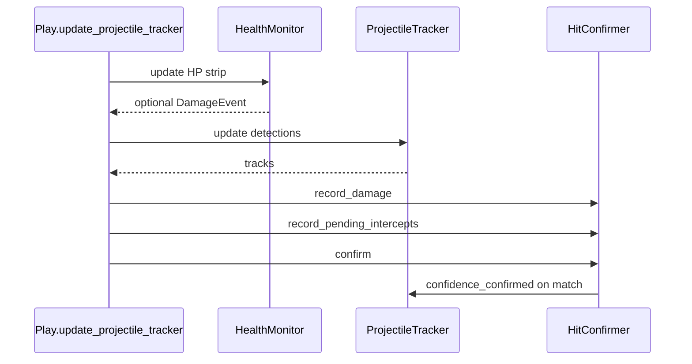

# Reinforcement learning movement (this fork's headline feature)

**Pyla-RL** is a reinforcement-learning fork of PylaAi-XXZ. It keeps
every brawler-specific attack, super, and gadget rule exactly as it was.
The only thing the RL policy controls is **movement** (approach /
retreat / strafe / dodge). Combat is run by `Play.run_combat()` after
the movement choice is made, so attack timing and aiming are unchanged
regardless of which mode is active.

Why this fork exists:

- Heuristic movement is brittle and brawler-specific. PPO learns
  positioning that generalises across brawlers from live frames.
- Projectile dodging is the single biggest source of damage — the
  tracker + reward shaping in this folder is built for that.
- All of this runs *on top of* the existing bot, so attacks/supers
  remain stable while movement is learned online.

## Settings (`cfg/bot_config.toml`)


| Key                           | Default                                        | Effect                                                                                                                                                                                                                                                                                           |
| ----------------------------- | ---------------------------------------------- | ------------------------------------------------------------------------------------------------------------------------------------------------------------------------------------------------------------------------------------------------------------------------------------------------ |
| `use_rl_movement`             | `"no"`                                         | Master switch. When `"yes"`, the RL policy drives movement and the heuristic `get_movement` / `get_showdown_movement` / `enemy_pressure_movement_fallback` paths are bypassed. Combat (attacks, supers, gadgets) still runs heuristically.                                                       |
| `enable_rl_movement_training` | `"no"`                                         | When `"yes"`, the bridge collects rollouts from live frames and runs `model.learn()` on a worker thread every `rl_train_steps_per_update` frames; weights are written back to `rl_movement_model_path`. When `"no"`, the policy runs in inference-only mode. Requires `use_rl_movement = "yes"`. |
| `rl_movement_model_path`      | `models/rl_movement_policy.zip`                | SB3 PPO checkpoint location. Auto-created on first training start.                                                                                                                                                                                                                               |
| `rl_max_projectiles`          | `6`                                            | K nearest projectiles included in the observation when `rl_use_projectile_features=yes` .                                                                                                                                                                                                   |
| `rl_use_projectile_features` | `"yes"` *(when key omitted)* / `"no"` in repo default | When `"no"`, the RL policy uses `max_projectiles=0` (8-dim observation) and projectile boxes are skipped in `update_projectile_tracker` whenever `rl_show_projectile_debug=no` — saves CPU while RL-only movement trains on HP + placement rewards.                                                                             |
| `rl_show_projectile_debug` | `"yes"` *(when key omitted)* / `"no"` in repo default | When `"no"`, projectile tracks are not drawn on the RL visual-debug overlay (`Play.show_visual_debug`).                                                                                                                                                                                         |
| `rl_use_hp_drop_penalty`     | `"yes"` in repo default                        | When `"yes"`, per-step penalty uses `HealthMonitor.recent_damage_event` (generic HP loss: storm, melee, shots). Projectile-tracker gates are bypassed *for rewards* only (`compute_reward`).                                                                                                                                    |
| `rl_hp_drop_penalty`          | `-1.0`                                         | Penalty magnitude when HP drop is detected in the damage-confirm window.                                                                                                                                                                                                                           |
| `rl_rank_reward_1st` … `rl_rank_reward_4th` | `3.0 / 1.0 / 0.0 / -1.5` | Terminal PPO reward on match reset when showdown end screen resolves to `"1st"`–`"4th"` (`state_finder` templates).                                                                                                                                                                              |
| `rl_result_reward_victory` / `defeat` / `draw` | `2.0 / -1.5 / 0.0` | Terminal rewards for `"victory"`, `"defeat"`, `"draw"` (`end_*` states in non-showdown modes).                                                                                                                                                                                                    |
| `rl_episode_end_fallback_reward` | `0.0` | Used when `_pending_end_result` is unknown (disconnect, missing template). Older builds always paid `survival_episode_bonus`; this avoids paying a phantom win bonus.                                                                                                                                   |
| `rl_projectile_classes`       | `["projectile","super","bullet","enemy_shot"]` | Detector class names that the projectile tracker treats as incoming hazards. Add/remove names here to match the names the YOLO model emits.                                                                                                                                                      |
| `rl_combat_blend_dodge`       | `"yes"`                                        | When in attack range, still blend the existing `apply_combat_dodge` strafe on top of the RL angle so attacks look natural.                                                                                                                                                                       |

### Projectile tracking backend (`cfg/bot_config.toml`)

| Key | Default | Effect |
| --- | ------- | ------ |
| `projectile_tracker_backend` | `"bytetrack"` | `"bytetrack"` uses [`supervision`](https://github.com/roboflow/supervision) `ByteTrack` (`rl/byte_projectile_tracker.py`). `"greedy"` uses the legacy greedy matcher in [`rl/projectile_tracker.py`](../rl/projectile_tracker.py). If `supervision` is missing, the bot logs once and falls back to greedy. |
| `projectile_bytetrack_high_thresh` | `0.5` | ByteTrack `track_activation_threshold` — detections above this take the high-score association path. |
| `projectile_bytetrack_low_thresh` | `0.1` | Reserved (library lower bound for low-score path is fixed in `supervision`); kept for future tuning. |
| `projectile_bytetrack_match_thresh` | `0.8` | ByteTrack `minimum_matching_threshold` for IoU matching. |
| `projectile_bytetrack_lost_seconds` | `0.5` | Converted to `lost_track_buffer` frames via `projectile_bytetrack_frame_rate`. |
| `projectile_bytetrack_frame_rate` | `30` | Nominal FPS passed to ByteTrack (lost-buffer scaling). |

Synthetic per-detector confidences are assigned before ByteTrack: `labeled=0.85`, `residual=0.55`, `motion=0.40` so YOLO boxes stay in the high path and motion blobs can use the low path.

### Intercept confirmation (`cfg/bot_config.toml`)

When **`cross_reference_projectile_hits = "yes"`** and **`intercept_confirm_enabled = "yes"`**, RL damage uses [`HitConfirmer`](../rl/hit_confirmer.py): each frame the tracker exposes `pending_intercepts` (incoming tracks with an ETA to overlap the player box). Expected wall-clock hit time is `now + eta`. A [`DamageEvent`](../rl/health_monitor.py) within **`intercept_confirm_tolerance_seconds`** of that time confirms the paired track (`confidence_confirmed`) and feeds `projectile_hit` via recent confirmations — **not** the older `is_player_hit AND recent_damage_event` boolean.

| Key | Default | Effect |
| --- | ------- | ------ |
| `intercept_confirm_enabled` | `"yes"` | Master switch (also hub checkbox). Requires `cross_reference_projectile_hits = "yes"` to take effect. |
| `intercept_confirm_tolerance_seconds` | `0.30` | Max \|predicted hit time − damage time\| for a match. |
| `intercept_confirm_max_lookahead_seconds` | `1.00` | Horizon for `ProjectileTrack.time_to_player_box` when building intercepts. |
| `intercept_confirm_min_streak` | `2` | Minimum `match_streak` for an intercept to count (same idea as promotion). |



### Health bar, damage events, red flash, cross-reference (`cfg/bot_config.toml`)

These tighten projectile **perception** and the RL **hit signal** when motion/residual layers hallucinate hits during damage flashes or UI tint.

| Key | Default | Effect |
| --- | ------- | ------ |
| `health_bar_band_offset_px` | `8` | Vertical offset from player box top to HP strip (scaled by window scale factor). |
| `health_bar_band_height_px` | `14` | Height of HSV strip used for fill ratio. |
| `health_bar_search_height_px` | `40` | Vertical search window above the player to auto-align the HP strip when the fixed offset is slightly off. |
| `health_bar_horizontal_pad_px` | `26` | Minimum extra half-width (× scale) added to the crop so the HP bar fits when it is wider than the brawler box. |
| `health_bar_width_expand_frac` | `0.22` | Extra horizontal padding as a fraction of the player half-width (combined with the pad above). |
| `health_hsv_min_saturation` / `health_hsv_min_value` | `52` / `52` | Primary OpenCV HSV lower bounds for classifying UI green/red/yellow; lower values tolerate dim or bloomy HUD. |
| `health_hsv_relaxed_min_saturation` / `health_hsv_relaxed_min_value` | `38` / `38` | Fallback thresholds when the primary pass counts too few pixels (same game frame, avoids false `insufficient_pixels`). |
| `health_bar_yellow_enabled` | `"yes"` | Count yellow/orange HSV as “alive” HP fill (low HP). |
| `health_bar_shield_enabled` | `"yes"` | Count cyan HSV as “alive” (shield overlay). |
| `health_bar_min_total_pixels` | `40` | Target minimum colored pixels; the reader also scales this down for very small search crops (near the top of the screen). |
| `health_bar_min_consecutive_drops` | `2` | Consecutive frames below the prior-window max (by threshold) before emitting a `DamageEvent` (reduces single-frame flicker). |
| `health_ocr_enabled` | `"yes"` | Optional EasyOCR read of numeric HP (throttled); drives `hp_value` / `observed_max_hp` for debug. |
| `health_ocr_interval_seconds` | `0.5` | Minimum time between OCR passes. |
| `health_ocr_validate_against_hsv` | `"yes"` | If OCR fraction and HSV disagree by >25%, `last_hp_status = inconsistent` and HSV is trusted for logic. |
| `health_ocr_max_relative_jump` | `0.4` | Reject OCR readings that jump more than this fraction vs the previous accepted value. |
| `damage_hp_drop_threshold_pct` | `0.015` | Emit a damage event when valid HP% drops more than this vs rolling max in the prior ~0.4 s window. |
| `damage_confirm_window_seconds` | `0.5` | Lookback for “recent damage” when confirming tracks and when gating RL hits. |
| `red_flash_detect_enabled` | `"yes"` | Enable full-frame red-dominance spike detector (`rl/red_flash.py`). |
| `red_flash_red_dom_threshold` | `1.40` | Flash when `mean(R) / (0.5*(mean(G)+mean(B)))` exceeds baseline × this factor. |
| `red_flash_baseline_alpha` | `0.1` | EMA smoothing for the baseline when not flashing. |
| `cross_reference_projectile_hits` | `"yes"` | If `"yes"`, RL hit signal is strict (see intercept table). With **`intercept_confirm_enabled = "yes"`**, uses [`HitConfirmer`](../rl/hit_confirmer.py). Otherwise: requires **`ProjectileTracker.is_player_hit`** **and** a recent `HealthMonitor` damage event within `damage_confirm_window_seconds`. |

Implementation files: [`rl/health_monitor.py`](../rl/health_monitor.py), [`rl/red_flash.py`](../rl/red_flash.py), [`rl/hit_confirmer.py`](../rl/hit_confirmer.py), [`rl/byte_projectile_tracker.py`](../rl/byte_projectile_tracker.py); wiring in [`play.py`](../play.py) (`update_projectile_tracker`, visual debug); reward glue in [`rl/policy_bridge.py`](../rl/policy_bridge.py).

The same toggles are exposed as checkboxes in `gui/hub.py` (`Use RL Movement`, `Enable RL Movement Training`).

## Architecture

```
frame ─► Detect ─► data{player,enemy,teammate,wall,[projectile,super,...]}
                              │
              ┌────────────────┴────────────────┐
              │ RedFlashDetector (optional)      │
              │ HealthMonitor.update (HP % / OCR) │
              └────────────────┬────────────────┘
                              │
                              ▼
                       update_projectile_tracker()
                         (skip motion/residual if flashing;
                          after tracker.update: confirm tracks on damage,
                          purge unconfirmed young motion/residual)
                              │
                              ▼
       ┌──────────── Play.loop ────────────┐
       │                                    │
       │   if use_rl_movement:              │
       │       compute_rl_movement()        │
       │           └► RLMovementBridge       │
       │                  ├─ build_observation
       │                  ├─ model.predict   │
       │                  ├─ submit_transition (training)
       │                  └─ maybe learn() (worker thread)
       │                                    │
       │   run_combat(brawler, data, mvmt)   │
       │       └► attack/super/gadget       │
       │                                    │
       └─► do_movement(mvmt) ── window controller (joystick / WASD)
```

The Gym env (`rl/movement_env.py`) is **externally driven**: it does not
own a simulator. The bridge submits one transition per frame
(`submit_transition`) and SB3 PPO consumes them through the standard
`reset()` / `step()` interface, so the public surface looks like a
normal Gym env from the trainer's perspective.

## Reward shaping


| Component                  | Default                                                                | Notes                                                                                                                                                                                                                                                  |
| -------------------------- | ---------------------------------------------------------------------- | ------------------------------------------------------------------------------------------------------------------------------------------------------------------------------------------------------------------------------------------------------ |
| Survival                   | `+0.01` per step                                                       | Continuous bonus for staying alive.                                                                                                                                                                                                                    |
| Safe band vs nearest enemy | `+0.02` when enemy distance is in `[0.35, 0.75] * frame_diagonal/2`    | Encourages "in attack range, out of danger" positioning.                                                                                                                                                                                               |
| Teammate proximity         | `+0.01` when teammate distance is in `[0.05, 0.30] * frame_diagonal/2` | Encourages staying near teammates as the user requested.                                                                                                                                                                                               |
| Projectile / intercept hit (`rl_use_hp_drop_penalty=no`) | `-1.0`                                                                 | Tracker + `HitConfirmer` / cross-reference semantics described in [`policy_bridge.py`](policy_bridge.py) (matches the older projectile-focused mode).                                                                             |
| HP drop penalty (`rl_use_hp_drop_penalty=yes`)           | `-1.0` (see `rl_hp_drop_penalty`)                                      | Applies when [`HealthMonitor.recent_damage_event`](../rl/health_monitor.py) fires inside `damage_confirm_window_seconds`. Encourages storm avoidance / generic survivability without projectile geometry in the observation.          |
| Episode-end placement / result                           | showdown `1st/2nd/3rd/4th` + `victory/defeat/draw` (configurable)       | Dispatched via `Play._pending_end_result` (`main.py` records `state.split("_", 1)[1]` for `end_*` states). [`episode_terminal_reward()`](movement_env.py) picks the SB3 terminal reward consumed by [`RLMovementBridge.on_match_reset()`](policy_bridge.py). Inference (`train=no`) keeps terminal bonus at `0` like the legacy rollout path. |

## Health bar and damage events

[`HealthMonitor`](../rl/health_monitor.py) searches a band **above** the player box (adaptive vertical search within `health_bar_search_height_px`), measures **green / yellow / shield cyan vs red** HSV pixels for HP fill ratio, applies a short median smoother, and maintains a short history. A **`DamageEvent`** is emitted when the smoothed reading drops sharply versus the rolling maximum in the prior window — optionally requiring **`health_bar_min_consecutive_drops`** consecutive sub-threshold frames. Optional **EasyOCR** (throttled) reads numeric HP; large jumps are rejected, **`observed_max_hp`** only bumps after the same reading is seen twice, and disagreement with HSV sets `last_hp_status = inconsistent`. Percent-based logic drives damage detection.

| `last_hp_status` | Meaning |
| --- | --- |
| `ok` | Usable reading. |
| `insufficient_pixels` | Too few HSV hits in the band (noisy/too small crop). |
| `respawn` | Respawn overlay gate active. |
| `inconsistent` | OCR and HSV HP fraction disagree strongly. |
| `unknown` | Missing player box or empty reading. |

## Red-flash frame gating

[`RedFlashDetector`](../rl/red_flash.py) flags frames where the full-frame mean red channel dominates green/blue (damage vignette). When active, **`update_projectile_tracker`** clears **motion** and **residual** candidate lists for that frame and **does not advance** the motion grayscale baseline, while **labeled** YOLO projectile boxes still feed the tracker. Damage-driven **track confirmation** is skipped for that frame so the tint does not corroborate phantom hits.

## Tracker confirmation and purge

Each [`ProjectileTrack`](../rl/projectile_tracker.py) carries **`confidence_confirmed`**. When **`intercept_confirm_enabled`** is on, [`HitConfirmer`](../rl/hit_confirmer.py) sets this when predicted impact time matches a damage event. Otherwise (legacy), after a tracker update, if a recent damage event exists, **`confirm_tracks_touching_player`** marks overlapping / short-lookahead incoming tracks (same geometry as **`is_player_hit`**). **`purge_unconfirmed_recent_tracks`** removes young **`motion`** / **`residual`** tracks with **`from_enemy != True`** that were never confirmed — trimming ghosts born from flashes or noise.

## Visual debug

With visual debug enabled in [`cfg/general_config.toml`](../cfg/general_config.toml), [`Play.show_visual_debug`](../play.py) can draw:

- An **HP bar** strip and OCR-derived **`HP cur/max`** when available.
- A top **RED FLASH** banner while the red-flash detector is active.
- Projectile labels **`proj{id}*`** when **`confidence_confirmed`** is true **and `rl_show_projectile_debug=yes`**.

## Projectile direction gate

Vision detectors and the residual/motion blob fallback both produce a
lot of false positives — friendly shots flying away, particles, idle
map animations. The tracker now applies a **direction gate** so only
tracks whose smoothed velocity is heading at the player are counted by
`is_player_hit` and shown to the policy through `observation_features`.

The gate is a single dot product
`cos = (velocity · (player − projectile)) / (|velocity| · |player − projectile|)`
that must be `>= incoming_min_alignment` (and the track must move at
least `min_speed_px_s`). The hub's **Projectile Detection Confidence**
slider (`projectile_detection_confidence` in `cfg/bot_config.toml`,
default `0.55`) maps `0..1` to a cosine threshold via
`align = 2*conf - 1`, so:

| Confidence | Cosine threshold | Approx half-angle |
| ---------- | ---------------- | ----------------- |
| `0.50`     | `0.0`            | `±90°`            |
| `0.65`     | `0.3`            | `±73°`            |
| `0.75`     | `0.5`            | `±60°`            |
| `0.90`     | `0.8`            | `±37°`            |

The same threshold is also applied at the merge step in
`Play._filter_candidates_toward_player`, which drops residual/motion
candidates whose displacement vs. the previous frame is clearly heading
away from the player (labeled YOLO classes always pass through and are
gated by the tracker once they have velocity).

### Enemy-origin requirement

A track is only classified as a real projectile if its **first
detection** was inside or just outside an enemy hitbox **and** not near
the player or a teammate. This is what stops friendly shots flying past
us, particle bursts on map decorations, and idle animations from being
treated as incoming threats.

Each new `ProjectileTrack` is tagged with a `from_enemy: Optional[bool]`
at birth:

| Value   | Meaning                                                                          | Counts as projectile? |
| ------- | -------------------------------------------------------------------------------- | --------------------- |
| `True`  | spawn point within `rl_projectile_enemy_origin_radius` of an enemy box          | yes                   |
| `False` | enemies were visible but the spawn point wasn't near one (or was near a friendly) | no                    |
| `None`  | no enemy or player/teammate boxes available at birth (we can't decide)          | yes (don't go blind in bushes) |

Relevant config in `cfg/bot_config.toml`:

| Key                                      | Default | Effect                                                                                                                          |
| ---------------------------------------- | ------- | ------------------------------------------------------------------------------------------------------------------------------- |
| `rl_projectile_require_enemy_origin`     | `"yes"` | Master switch. When `"no"`, the origin tag is computed but ignored, and the old direction-only filter behaves as before.        |
| `rl_projectile_enemy_origin_radius`      | `140`   | Pixel radius around an enemy box where a new spawn still counts as enemy-spawned. Increase if enemies fire from offsets/weapons that exceed the hitbox. |
| `rl_projectile_friendly_origin_radius`   | `100`   | Pixel radius around the player/a teammate that suppresses classification (i.e. our own shots flying away).                      |

## Score / telemetry

`RLMovementBridge` keeps running counters and prints a one-line summary
every ~3 seconds (and on every match reset). All `print` output is
mirrored into `logs/pyla_<timestamp>.log` by `logger_setup.py`, so the
RL score is on disk for every run with no extra setup.

Format:

```
[RL] step=12345 ep_steps=812 ep_reward=+5.273 reward/step=+0.006 mean100ep=+3.84 penalty_hit=False
[RL] episode_end ep_reward=+8.273 ep_len=812 result=1st rank_bonus=+3.000 mean100ep=+3.84
```

`mean100ep` is the trailing average of the last 100 episode returns —
useful when training to see whether the policy is improving without
having to load TensorBoard.

## Running with no projectile model yet

The vision model in `models/mainInGameModel.onnx` ships with the
classes `enemy / teammate / player`. None of `rl_projectile_classes`
will appear in the per-frame `data` dict, so the projectile tracker
stays empty and the projectile slots in the observation are zero-padded
correctly. The RL policy can still learn from player/enemy/teammate
geometry; you only get the dodge-aware reward signal once projectiles
are detectable.

To enable real projectile tracking:

1. Add labels for projectiles / supers (one per object type you want to
  distinguish, or a single `projectile` super-class) to your YOLO
   dataset and retrain via `tools/train_vision_model.py`.
2. Re-export the ONNX model and replace `models/mainInGameModel.onnx`.
3. Update the `classes=[...]` argument in `play.py` (`Detect_main_info`)
  so the new class IDs are decoded:
4. Adjust `rl_projectile_classes` in `cfg/bot_config.toml` to match the
  exact class names you trained.

After that the per-frame `data` dict will contain
`data["projectile"]` / `data["super"]` boxes, the tracker will assign
IDs and velocities, and the reward function will start penalizing
collisions automatically.

## Tests

Unit tests live in `tests/test_rl_*.py` and related setup tests:

- `test_rl_projectile_tracker.py`: matching, velocity estimation,
history pruning, hit detection (with and without lookahead),
observation feature shape and ordering, **`purge_unconfirmed_recent_tracks` / confirmed tracks**.
- `test_rl_movement_env.py`: observation layout / clipping / size and
reward components (penalty, episode bonus).
- `test_rl_action_mapping.py`: 2D action → showdown angle / WASD string
mapping.
- `test_health_monitor.py`: HSV band ratios, adaptive search, debounced drops, insufficient-pixel guard, sharp drop vs gradual drift damage events.
- `test_byte_projectile_tracker.py`: ByteTrack ID continuity (skipped if `supervision` missing).
- `test_intercept_confirmer.py`: tolerance matching for `HitConfirmer`.
- `test_red_flash.py`: red spike after green baseline vs steady frames.
- `test_setup_amd_rocm.py` / `test_setup_bootstrap.py`: AMD ROCm helper parsing and bootstrap batch contents (see root [`README.md`](../README.md)).

Run them in isolation with:

```
python -m unittest tests.test_rl_projectile_tracker tests.test_rl_movement_env tests.test_rl_action_mapping tests.test_health_monitor tests.test_red_flash
```

These tests do **not** require `stable-baselines3`; they only exercise
the pure-Python helpers and the projectile tracker. Importing
`rl/policy_bridge.py` for a live run does require `stable-baselines3`
and `gymnasium` (added to `setup.py`).

## Known gaps / follow-ups

- HP bar geometry assumes the default **1920×1080**-style HUD; extreme resolutions or skins may need tuning `health_bar_*` keys.
- OCR depends on **EasyOCR** cold start and CPU/GPU load; it is throttled and optional (`health_ocr_enabled`).
- Without retrained vision, projectile tracks are always empty when YOLO never emits projectile classes — the projectile slots pad with zeros (`rl_use_projectile_features=yes`) or shrink away entirely (`=no`). With **`rl_use_hp_drop_penalty=yes`**, HP drops carry the avoidance signal regardless.
- Turning **projectiles on/off**, changing **`rl_max_projectiles`**, or swapping outcome wiring changes the Gym observation size / terminal returns — reuse an SB3 checkpoint only when those hyper-parameters match what it was trained on (otherwise delete / pick a fresh `rl_movement_model_path`).
- The Gym env is single-environment (one `MovementEnv` per process).
A future change could vectorize it across multiple parallel
emulator instances if you want faster training throughput.
- `enemy_pressure_movement_fallback` is intentionally bypassed when RL
drives movement — it is a heuristic. Wall-stuck detection /
semicircle escape is kept as a safety net.

